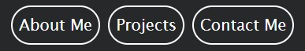
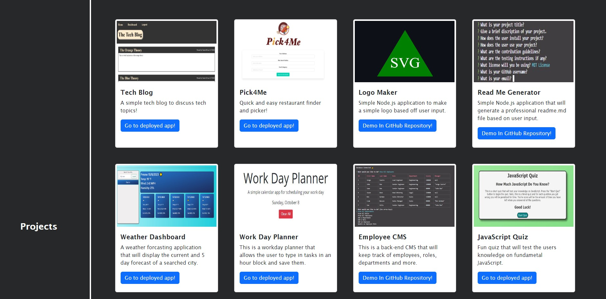

# My Portfolio

## Technology Used 

| Technology Used         | Resource URL           | 
| ------------- |:-------------:| 
| HTML    | [https://developer.mozilla.org/en-US/docs/Web/HTML](https://developer.mozilla.org/en-US/docs/Web/HTML) | 
| CSS     | [https://developer.mozilla.org/en-US/docs/Web/CSS](https://developer.mozilla.org/en-US/docs/Web/CSS)      |   
| Git | [https://git-scm.com/](https://git-scm.com/)     |    

## Description 

[Visit the Deployed Site](https://jacastro619.github.io/my-portfolio/)

This is my portfolio. I'm on a mission to learn as much as I can through education, challenges, and more. This portfolio is designed to showcase the projects I've completed during my time in the UC Berkeley Full Stack Engineering Bootcamp. In just the first week, I've absorbed a wealth of knowledge that enables me to build this portfolio from scratch.

Within this portfolio, you'll find a simple and clean design and layout. There's a navigation bar with functional links that will seamlessly guide you to specific sections of the page. You'll also come across a profile picture of myself and an 'About Me' section. As you delve deeper into the page, you'll discover my completed projects, alongside placeholders for the ones I have planned for the future. Toward the very bottom, you'll find a section with links to my GitHub profile and multiple ways to get in touch with me. Please don't hesitate to reach out anytime using the provided links in my portfolio.

## Usage

- Back To Top Button (bottom right of screen): At any moment you wish to go back to the top of the page, you may click the 'Back To Top' button and you will be taken back to the top of the page. No matter how far you scrolled down, the button will always be there for use. 

--------

- Navigation bar (top right): Here you will see three buttons, 'About Me', 'Projects', 'Contact Me'. Click on either of these buttons and you will be taken to the section of the page a specific button coresponds to.

--------

- Project Links (In project section): Here you will see images of my completed projects and some placeholders for future projects. You may click on a completed project of interest and it will direct you to that deployed project. At the moment there is only two projects that are completed with a working link. However, as more projects are completed, they will be added to the portfolio.

--------

- Contact Me Links (bottom of page): Here you will see three buttons, 'GitHub', 'LinkedIn', 'Send Email'. You may click on either of these button to be directed to either my GitHub page, LinkedIn profile, or your default email with a composed message with me as the recipiant. This is where you may contact me.

## Learning Points 

 I learned many ways to structure a page to fit the desired style and layout. Throughout this project, I was able to better understand the use of Flexbox and how to properly apply it to a page. Using CSS in the beginning can be daunting and overwhelming at first, but with multiple hours of hands-on practice, you start to see more clearly about how CSS works with a page. There are many ways to achieve an outcome in code, or as my instructor says, "There are many ways to pet a cat." No matter how it's said, it could not be more true. Being able to see different ways to achieve a desired outcome is definitely valuable to understand for future uses of CSS. The more exposure you get to using this material, the better you can understand how to tackle a challenge you may face in the future.

## Credit

Cover Image by Pete Linforth from Pixabay